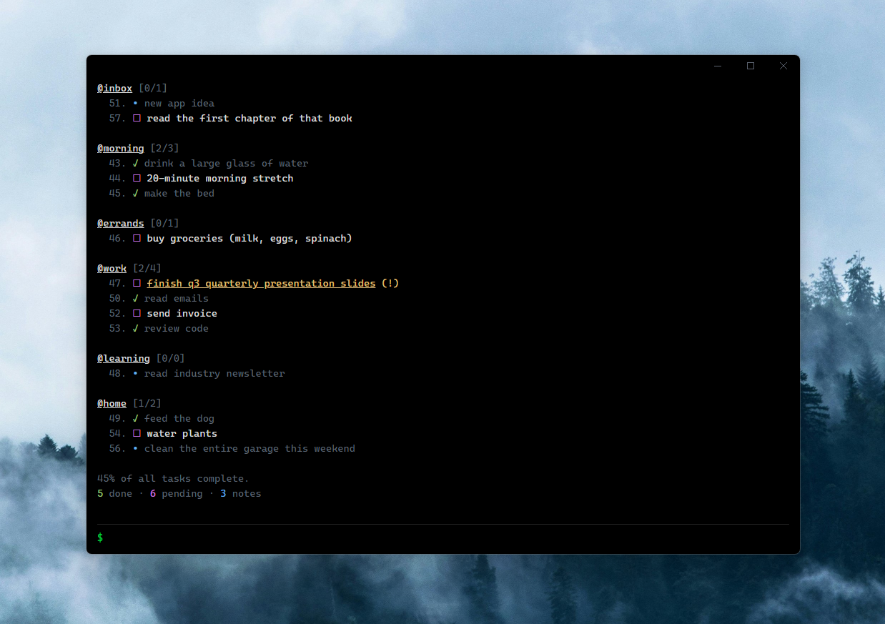

# Task Terminal

<div align="center">
  
</div>

Welcome to **Task Terminal**! 🚀 This is a dedicated pseudo-terminal desktop application designed to help you manage your tasks, notes, and boards using a distraction-free, command-line style interface. 📂🎯

🙌 **Credits:** This project is fundamentally based on the fantastic [Taskbook](https://github.com/klaudiosinani/taskbook) project.  
Huge thanks to the original creator for the stellar foundation! 🌟

## 🚀 Getting Started

Download from https://github.com/msparsh/task-terminal/releases or build it yourself.
### Build Instructions
#### Install the necessary dependencies 📦
```
npm install
```
#### Start the application ▶️
```
npm start
```

#### Build the application ⚒️
```
npm run build
```

## 🚧 Project Status & Architecture 

Please note that this is an actively evolving workspace! 🛠️🌀 The internal logic, UI layout, and storage mechanisms are subject to frequent changes and ongoing iteration. 🌱 Keep an eye out for updates as the project grows! ✨
